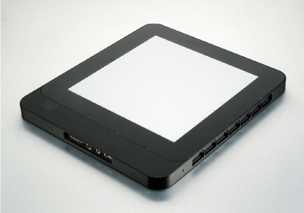

.. _camera-perkinelmer:

.. toctree::
  :maxdepth: 3

Perkin Elmer
------------



Intoduction
```````````
PerkinElmer is a world leader in the design, development, and manufacture of Amorphous Silicon (aSi) Flat Panel Detectors (FPD) designed to perform across a wide range of medical, veterinary, and industrial, Non-Destructive Testing (NDT) applications. Our XRD family of detectors provide superior image resolution, high frame rates up to 30 frames per seconds (fps), energy levels form 20 keV -15 MeV and easy information storage and retrieval.

The detector model we tested (ESRF) is : XRD 1621 CN ES
 
Module configuration
````````````````````
Previously to this you have to install the Perkinelmer SDK to the default path

The minimum configuration file is *config.inc* :

.. code-block:: sh

  COMPILE_CORE=1
  COMPILE_SIMULATOR=0
  COMPILE_SPS_IMAGE=1
  COMPILE_ESPIA=0
  COMPILE_FRELON=0
  COMPILE_MAXIPIX=0
  COMPILE_PILATUS=0
  COMPILE_PERKINELMER=1
  COMPILE_CBF_SAVING=0
  export COMPILE_CORE COMPILE_SPS_IMAGE COMPILE_SIMULATOR \
         COMPILE_ESPIA COMPILE_FRELON COMPILE_MAXIPIX COMPILE_PILATUS \
         COMPILE_PERKINELMER COMPILE_CBF_SAVING


See :ref:`Compilation`

Installation
`````````````

- After installing perkinelmer modules :ref:`installation`

- And probably Tango server :ref:`tango_installation`
